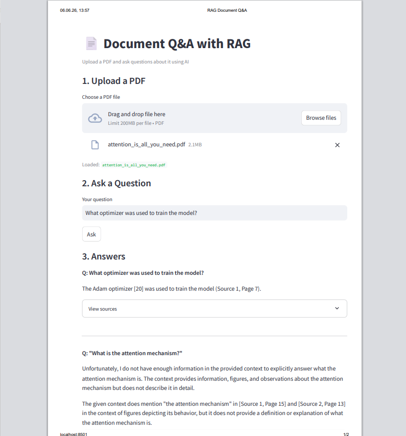

 

# 📄 RAG Document Q&A System

A production-ready Retrieval-Augmented Generation (RAG) system that lets you upload any PDF and ask questions about it using AI.

Built to demonstrate end-to-end RAG pipeline skills: document ingestion, semantic chunking, vector embeddings, FAISS retrieval, and LLM answer generation with source citations.

---

## 🏗️ Architecture

```
PDF Upload
    │
    ▼
┌─────────────┐
│   Loader    │  PyMuPDF — extract text page by page
└──────┬──────┘
       │
       ▼
┌─────────────┐
│   Chunker   │  LangChain RecursiveCharacterTextSplitter
│             │  chunk_size=500, overlap=50
└──────┬──────┘
       │
       ▼
┌─────────────┐
│   Embedder  │  sentence-transformers all-MiniLM-L6-v2
│             │  384-dimensional vectors, FAISS IndexFlatIP
└──────┬──────┘
       │
    FAISS
    Vector Store
       │
       ▼
┌─────────────┐     ┌──────────────┐
│  Retriever  │────▶│  Groq LLM    │
│  top-k=3    │     │  Llama 3.1   │
└──────┬──────┘     └──────┬───────┘
       │                   │
       ▼                   ▼
┌─────────────────────────────┐
│   Answer + Source Citations │
└─────────────┬───────────────┘
              │
    ┌─────────┴──────────┐
    │                    │
┌───▼────┐        ┌──────▼──────┐
│FastAPI │        │  Streamlit  │
│Backend │        │     UI      │
└────────┘        └─────────────┘
```

---

## ✨ Features

- Upload any PDF — research papers, reports, documentation
- Semantic chunking with configurable size and overlap
- Free local embeddings — no API cost for vector generation
- FAISS vector store — fast similarity search, fully local
- Answer generation with page-level source citations
- FastAPI backend with Swagger docs at `/docs`
- Streamlit UI for interactive Q&A
- Docker + docker-compose for one-command deployment
- GitHub Actions CI/CD pipeline

---

## 📊 System Stats

| Parameter | Value |
|---|---|
| Embedding model | all-MiniLM-L6-v2 |
| Embedding dimensions | 384 |
| Chunk size | 500 characters |
| Chunk overlap | 50 characters |
| Retrieval top-k | 3 chunks |
| LLM | Llama 3.1 8B (via Groq) |
| Test PDF | Attention Is All You Need (15 pages → 94 chunks) |

---

## ⚙️ Tech Stack

| Layer | Technology |
|---|---|
| PDF parsing | PyMuPDF |
| Chunking | LangChain RecursiveCharacterTextSplitter |
| Embeddings | sentence-transformers |
| Vector store | FAISS |
| LLM | Groq API (Llama 3.1) |
| Backend | FastAPI |
| UI | Streamlit |
| Containerisation | Docker + docker-compose |
| CI/CD | GitHub Actions |

---

## 🚀 Quick Start

### Option 1 — Docker (recommended)

```bash
git clone https://github.com/Akhila854/rag-document-qa.git
cd rag-document-qa
```

Add your Groq API key to `.env`:
```
GROQ_API_KEY=your_key_here
```

```bash
docker compose up
```

Open `http://localhost:8501`

---

### Option 2 — Local

```bash
git clone https://github.com/Akhila854/rag-document-qa.git
cd rag-document-qa
python -m venv venv
venv\Scripts\activate  # Windows
pip install -r requirements.txt
```

Add your Groq API key to `.env`:
```
GROQ_API_KEY=your_key_here
```

Terminal 1 — start API:
```bash
uvicorn api.main:app --port 8080
```

Terminal 2 — start UI:
```bash
streamlit run app.py
```

Open `http://localhost:8501`

---

## 📁 Project Structure

```
rag-document-qa/
├── app.py                  ← Streamlit UI
├── api/
│   ├── main.py             ← FastAPI app
│   └── routes.py           ← /upload and /ask endpoints
├── rag/
│   ├── loader.py           ← PDF text extraction (PyMuPDF)
│   ├── chunker.py          ← Text chunking (LangChain)
│   ├── embedder.py         ← Embeddings + FAISS index
│   └── retriever.py        ← Retrieval + LLM generation
├── data/                   ← Uploaded PDFs
├── vector_store/           ← Saved FAISS index
├── Dockerfile
├── docker-compose.yml
├── requirements.txt
└── .github/
    └── workflows/
        └── ci.yml
```

---

## 🔌 API Endpoints

| Method | Endpoint | Description |
|---|---|---|
| GET | `/` | Health check |
| POST | `/upload` | Upload PDF and build index |
| POST | `/ask` | Ask a question, get answer + sources |

Full docs at `http://localhost:8080/docs`

---

## 💡 Example

**Question:** What optimizer was used to train the Transformer?

**Answer:** The Adam optimizer was used with β1=0.9, β2=0.98 and ε=10⁻⁹.
*(Source: attention_is_all_you_need.pdf, Page 7)*

## 📸 Demo

